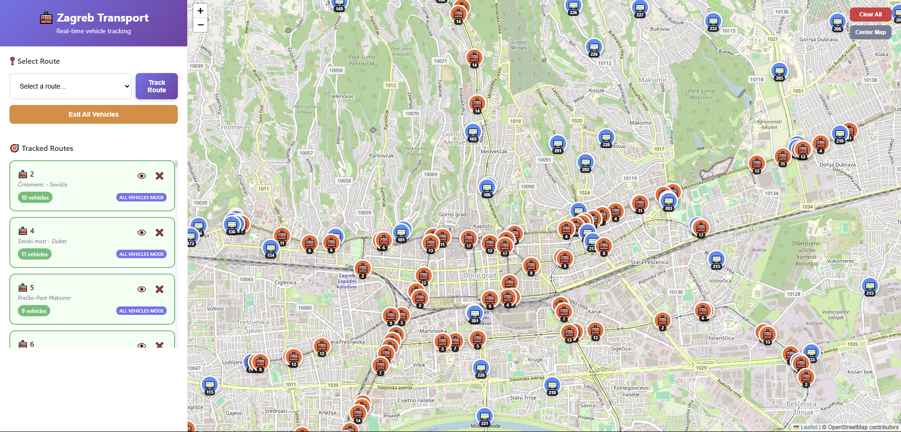

# Simple UI to represent the data
## Run with python
```bash
# change to client folder
cd \WebClients\simple-client

# (optional) activate virtual environment
python -m venv .venv
.venv\Scripts\activate

# start HTTP server
python -m http.server 8000
```
## Open localhost:8000
